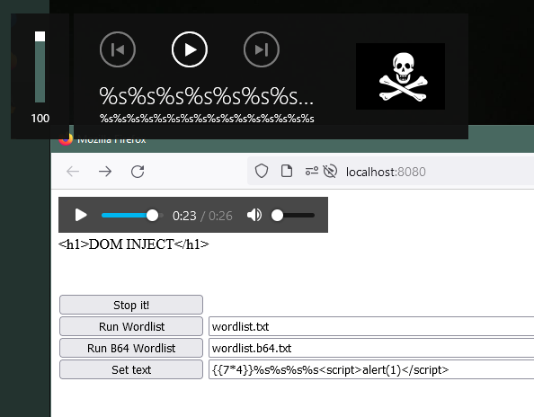

# Web MediaSession metadata fuzzer
Useful to throw spam at a AVRCP bluetooth device.

## Why
Serve it somewhere. Load up `index.html` on your phone. Connect your phone to a bluetooth stereo. Watch the crazy song titles flash on by. Break some stuff.

## How
The user interface is very simple:

`wordlist.txt` contains a plain text input, one word per line. Hit "Run Wordlist" to start.

`wordlist.b64.txt` contains encoded input, one base64-encoded word per line. Press "Run B64 Wordlist" to start.
